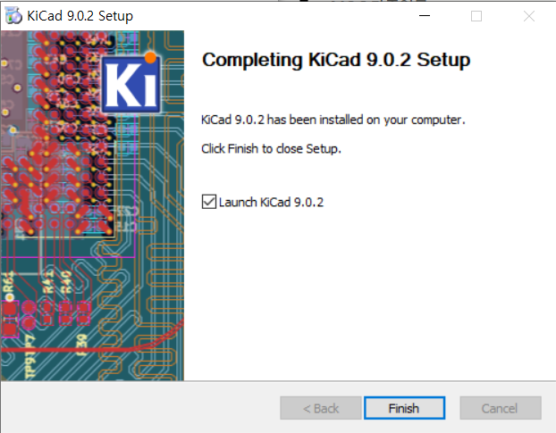

# KiCad 실습

이 저장소는 **KiCad**를 활용한 회로도 작성 및 PCB 설계 실습 예제를 모아둔 공간입니다.  
오픈소스 EDA(Electronic Design Automation) 툴인 KiCad의 기능을 익히고, 다양한 회로 설계 프로젝트를 경험해보는 것이 목적입니다.

## 개발환경

  
KiCad 9.0.2  

## 참고자료

- [KiCad 공식 웹사이트](https://www.kicad.org/)
- [KiCad 공식 문서](https://docs.kicad.org/)
- [전자부품 데이터시트 모음 (AllDataSheet)](https://www.alldatasheet.com/)
